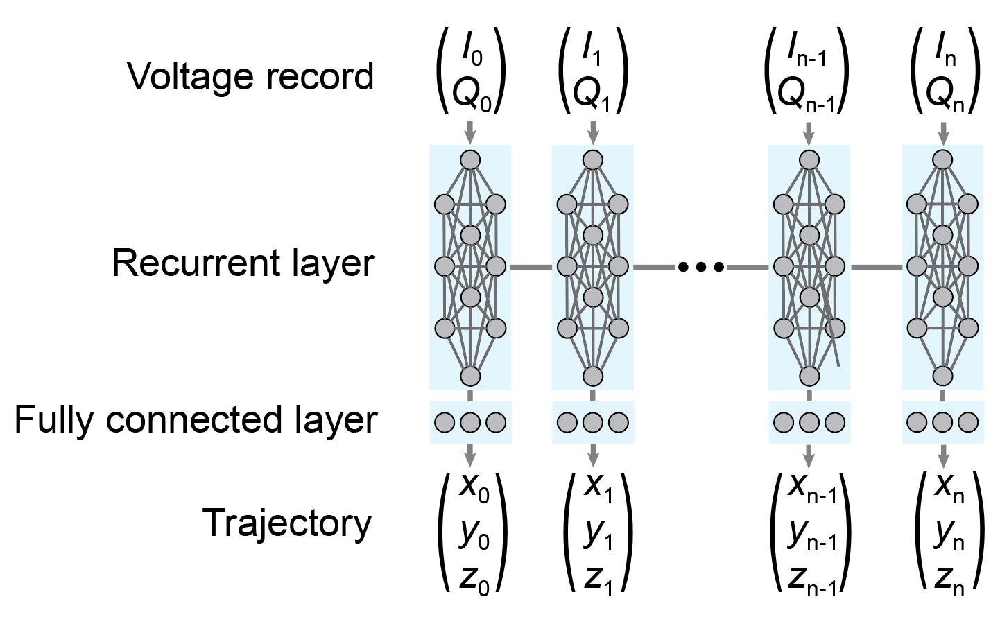
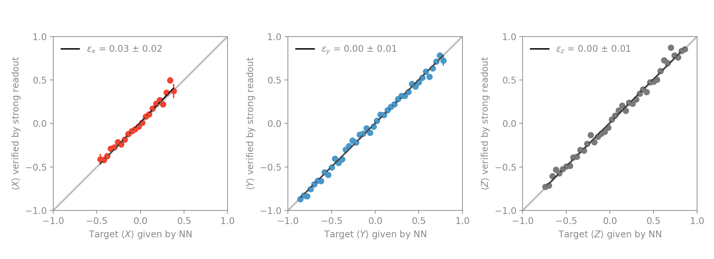
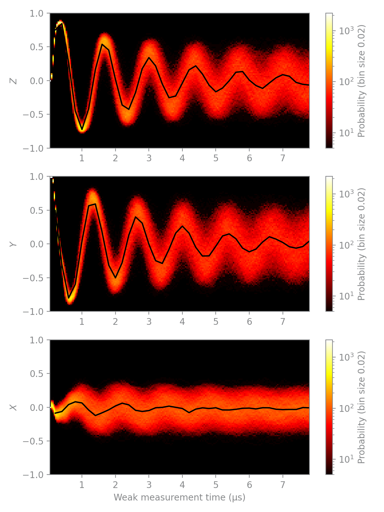

# Training trajectories with the qutrit_LSTM model
## Model
The model is defined in the file `qutrit_lstm_network.py` and consists of a many-to-many LSTM with a time-ordered Dense layer on top (see figure below). The model takes as input voltage record pairs (I(t), Q(t)) and produces an estimate for the probabilities (P0x, P1x, P0y, P1y, P0z, P1z) at each time t. These probabilities describe the probabilities for measurement of 0 or 1 for along the x, y and z measurement axes and are used to reconstruct the quantum state (before any collapse of the wavefunction).

To train the model we use a categorical cross entropy loss function, which enforces a penalty on a large distance between the strong readout result along measurement axis i and the probability of measuring 1 along that same axis i. Additionally, we enforce physicality of the quantum state by ensuring that the probabilities lie within the Bloch sphere, and we help the training by adding a term in the loss function proportional to the distance between the initial state and the probability estimate at time t = 0.



## Dataset
The dataset does not have to be in the same folder as the repository. The data should be contained in a single h5 file with the following keys: `meas_X`, `meas_Y` and `meas_Z`, which denote the measurement axis of the strong readout at the end of each trajectory. Each `meas_i` contains subkeys `t_n` where `n` indicates the length of the voltage records in units of strong readout intervals, and typically ranges from 0 to 40. The voltage records are found in `[meas_i/t_n/I_filtered]` and `[meas_i/t_n/Q_filtered]`. All of the loading is handled with methods from the module `qnl_trajectories`.

## Setting parameters in `settings.yaml`
The settings file contains all parameters that are used in `prep.py`, `train.py` and `analyze.py`. 
To change the hyperparameters of the network, you may change the parameters in this file; do NOT change things in any of the `.py` files.
The main settings are explained below.

### voltage records
* `data_points_for_prep_state` : number of weak measurement datapoints available for the first prep state.
* `filename` : filename of the h5 datafile that contains the raw voltage records
* `filepath` : location of the file specified in `filename`
* `num_features` : 1 (if using only a single quadrature) or 2 (if using $I$ and $Q$)
* `prep_state` : null (if you want to enforce strong readout at the first datapoint in the cost-function) or any of +Y, -Y, +Z, etc.
* `strong_ro_dt` : interval of the training labels in seconds, for example: 2.0e-7.

### prep
* `iq_scaling` : Factor used to scale the features for training to ensure the sigmoid activation function behaves correctly. 
* `output_filename` : No need to change this.
* `training_validation_ratio` : Float between 0.0 (all voltage records are used for validation) and 1.0 (all voltage records are used for training)

### training
* `epochs` : Number of epochs (an epoch is one forward and backward pass of all training voltage records through the network). The training will terminate after the number of epochs have elapsed.
* `experiment_id` : String that is appended to the save folder
* `lstm_neurons` : Number of nodes in the LSTM layer.
* `mask_value` : Replaces padded elements of the features and labels array with this value. Default: -1.0
* `mini_batch_size` : Number of voltage records that pass through the network at the same time during a training epoch.

## Workflow for training
1. Make sure you have configured your settings in the yaml file per the instructions above.
2.  To train trajectories, we start with setting up the visdom server. This lets you track training progress in real time, so run
```python -m visdom.server```. Then open the visdom server in your browser at `localhost:8097`. 
3. cd to the directory that contains the scripts `prep.py`, `train.py` and `analyze.py` and run ```python prep.py```. This splits the voltage records in a training and validation dataset and saves them to disk. Depending on the number of voltage records, this requires a few GB of free disk space, so a large SSD is preferred to speed up the saving and loading process.
4. To initiate the training, make sure the your paths in train.py and settings are set appropriately, and run ```python train.py```. This starts the training. You can now track progress in your visdom server window at `localhost:8097`. 
5. Upon completion of the training the code saves a file `trajectories.h5` in the analysis folder. We also pass the validation data through the network again to create a few diagnostics, which are explained below. 
6. Optional: run `python analyze.py` to perform further analysis.

## Diagnostics
Besides training loss and accuracy there are three main diagnostics to determine whether the training has succeeded or failed. The first diagnostic is the validation error, shown below.



This metric compares the predictions of the model (from validation data) to the strong readout results for all three measurement axes x, y and z. Ideally, this line should have slope 1 and the error is defined as the deviation from unit slope.

The second metric is a visual inspection of a histogram of the trajectories, again shown below.



The histogram of validation trajectories is overlayed with the averaged strong readout results. Ideally, the averaged strong readout results should follow the mean of the histogram at each timestep.

Finally, we can also quantify the training success with statistical measures of the fidelity and the trace distance. These are automatically printed when you run `analyze.py`. Please note that we use the definition of fidelity with the square (see [Wikipedia](https://en.wikipedia.org/wiki/Fidelity_of_quantum_states)).

## Further analysis

To run an extended analysis, including fitting of the data to Rabi models, we run

```python analyze.py```

The analysis first compares average trajectories to the strong readout results, and then fits a model to the average incremental changes dX, dY and dZ along trajectories to obtain parameters in the Hamiltonian. It also looks at the variance of the incremental changes to analyze the measurement back-action. Finally it has the ability to look at the average increments and variance of the increments as function of time.
