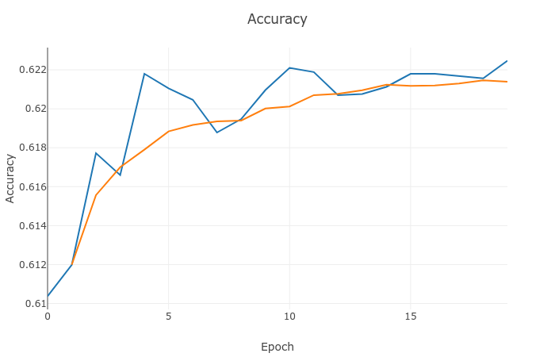
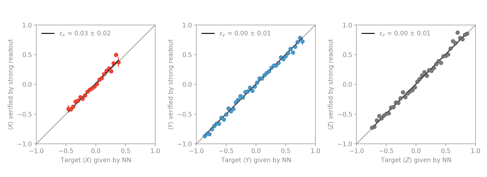

# Training trajectories with the Vanilla LSTM model
## Model
The model is defined in the file `vanilla_lstm.py` and consists of a many-to-many vanilla LSTM with a time-ordered Dense layer on top. The model takes as input voltage record pairs (I(t), Q(t)) and produces an estimate for the probabilities (P0x, P1x, P0y, P1y, P0z, P1z) at each time t. These probabilities describe the probabilities for measurement of 0 or 1 for along the x, y and z measurement axes and they can be used to reconstruct the quantum state (before any collapse of the wavefunction).
To train the model we use a categorical cross entropy loss function, which enforces a penalty on a large distance between the strong readout result along measurement axis i and the probability of measuring 1 along that same axis i. Additionally, we enforce physicality of the quantum state by ensuring that the probabilities lie within the Bloch sphere, and we help the training by adding a term in the loss function proportional to the distance between the initial state and the probability estimate at time t = 0.

## Dataset
The dataset should be stored in a subfolder called data and have subfolders `meas_X`, `meas_Y` and `meas_Z` denoting the measurement axis of the strong readout at the end of each trajectory.
In each subfolder, there is a single `.pickle` file, which contains trajectories of variable length. Loading is done with methods from the module `qnl_trajectories`.

## Training process
To train trajectories, we start with setting up the visdom server. This lets you track training progress in real time.

```python -m visdom.server```

You can open the visdom server in your browser at `localhost:8097`. 
Next, cd to the directory that contains the scripts `prep.py`, `train.py` and `analyze.py` and run

```python prep.py```

This splits voltage records in a training and validation dataset and saves them to disk. This requires at least 10 GB of free disk space, so a large SSD is preferred to speed up the saving and loading process.
To initiate the training, make sure the your paths in train.py and settings are set appropriately, and run

```python train.py```

This starts the training. You can now track progress in your visdom server window at `localhost:8097`:



Upon completion of the training the code saves a file `trajectories.h5` in the analysis folder, which is used as input for analyze.py. We also pass the validation data through the network again to create a few diagnostics, which are explained below. 

## Diagnostics
Besides training loss and accuracy there are two main diagnostics to determine whether the training has succeeded or failed. The first diagnostic is the validation error, shown below.



This metric compares the predictions of the model (from validation data) to the strong readout results for all three measurement axes x, y and z. Ideally, this line should have slope 1 and the error is defined as the deviation from unit slope.

The second metric is a visual inspection of a histogram of the trajectories, again shown below.


The histogram of validation trajectories is overlayed with the averaged strong readout results. Ideally, the averaged strong readout results should follow the mean of the histogram at each timestep.

## Further analysis

To run an extended analysis, including fitting of the data we run

```python analyze.py```

Of course, make sure that the paths in analyze.py point to the appropriate data and analysis folders. The analysis first compares average trajectories to the strong readout results, and then fits a model to the average incremental changes dX, dY and dZ along trajectories to obtain parameters in the Hamiltonian. It also looks at the variance of the incremental changes to analyze the measurement back-action. Finally it has the ability to look at the average increments and variance of the increments as function of time.
